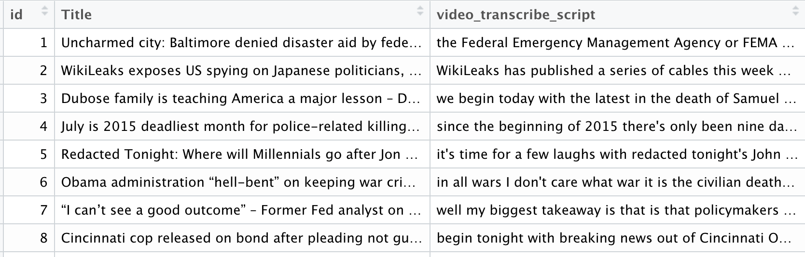

```{r setup, include=FALSE}
knitr::opts_chunk$set(echo = TRUE)
library(tidyverse) 
library(tidytext)
library(topicmodels)

```

```{r include=F}
RT <- read.csv("RT_America.csv")
RT_tidy <- RT %>% 
  unnest_tokens(input = video_transcribe_script, output = word)

```


# Topic Modeling 

>- Topic modeling is an **unsupervised** method of classification of text documents

>- Useful for data that is neither classified or labeled (no variables to guide the classification algorithm)

>- Topic Modeling helps **discover** underlying groups in textual data. 

# Data

- Scraped RT America YouTube videos (2015:2017)
- N = 3569



# Steps 

1. Convert data to Tidy Text 

2. Convert Tidy Text to DTM (Document Term Matrix)

3. Run Topic Model (LDA or Latent Dirichlet allocation)

3. Convert output of LDA to Tidy Data 

4. Classify Documents into Topics


# Tidy Text

Tidy text is a one-token-per-row dataset.

```{r}
RT_tidy[1:10,-2]
```


# Document Term Matrix (DTM)

- A document-term matrix describes the frequency of terms that occur in each document.

- In a document-term matrix, rows correspond to documents and columns correspond to terms.

- Will have many many many columns.... but we never have to look at it! 

- It is important because the topicmodels package requires DTM and not Tidy Text. 


# Latent Dirichlet allocation (LDA)

Latent Dirichlet allocation is one of the most common algorithms for topic modeling. It does two things. It does some Bayesian magin and as the result: 

- Models every document as a **mixture** of topics. 

- Models every topic as a **mixture** of words. 

LDA is a mixed-membership model. Every document has an association with each topic with a certain probabiliy. 


# Latent Dirichlet allocation (LDA)

- Topic Model doesnt tell you how many topics might be in your corpus. 

- You have to tell the model that using human intuition! 

- That's the parameter "k" that you have to decide upon and there are NO RULES on how you will decide. 
- Topic model also won't name the topics for you - you will have to do it yourself based on the words associated with each topic. 

# Acknowledgments 

- [Text Mining with R](https://www.tidytextmining.com/index.html)
- [An Introduction to Topic Modeling](https://www.youtube.com/watch?v=IUAHUEy1V0Q&t=271s&ab_channel=SummerInstituteinComputationalSocialScience)


